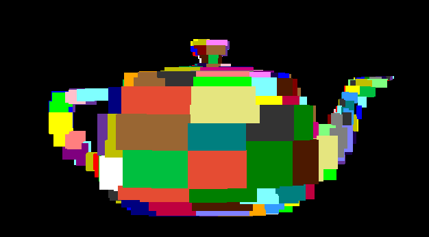

# Portal Raytracer

Raytracer built using OpenCL and Pygame (to render the output to a window). It supports portals allowing for "non-Euclidean" rendering, where you can see through portals to other parts of the scene. A BVH (Bounding Volume Hierarchy) is used for fast ray tracing, and the scene is exported from Blender using a custom add-on.


## Instructions to run:
```
uv run ./raytracer.py
```

## Performance
The raytracer is written in OpenCL to take advantage of parallel processing capabilities. Performance is decent considering my tests on a mid-range CPU (i5-10210U). The raytracer consistently runs at > 30 FPS and even > 60 FPS in some simple scenes. BVH construction is done in Python and not optimized.

## BVH
BVH Debug view at depth 8 of the Utah teapot.


## TODO
- [x] BVH
- [x] Render portals conditionally based on normal / winding direction
- [x] Add support for multiple portals
- [x] Texture support
    - [ ] Alpha blending
- [ ] DLSS
- [x] Blender add-on to export portal scene